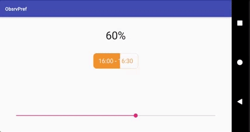

# SugarPreferences


[](https://jitpack.io/#rakshakhegde/SugarPreferences)

Interacting with `SharedPreferences` made simple. Check out the [sample app code](app/src/main).

### Please sign up for my newsletter **[rakshakhegde](https://upscri.be/b00b87/)** 📧

## Setup

Add this in your root `build.gradle` at the end of repositories:
```gradle
allprojects {
    repositories {
        ...
        maven { url 'https://jitpack.io' }
    }
}
```
Step 2. Add the dependency in your `app` module's `build.gradle` file
```gradle
apply plugin: 'kotlin-kapt'  // this line only for Kotlin projects

android {
    ...
    dataBinding.enabled true
}

dependencies {
    compile 'com.github.rakshakhegde:SugarPreferences:0.1-alpha'
    kapt 'com.android.databinding:compiler:GRADLE_PLUGIN_VERSION' // this line only for Kotlin projects
}
```

## Usage

```java
ObservableInt progressPref;
// "PROGRESS" is key name with Int value type
progressPref = new ObsrvIntPref("PROGRESS"); // uses default SharedPrefs with defaultVal 0 or,
progressPref = new ObsrvIntPref("PROGRESS", 56); //uses default SharedPrefs with defaultVal 56, or,
progressPref = new ObsrvIntPref("PROGRESS", 56, yourPreferences); // uses your SharedPreferences instance instead of default one

progressPref.get(); // Gets directly from Default SharedPreferences
progressPref.set(42); // Saves to Default SharedPreferences

// Listen for property updates
progressPref.addOnPropertyChangedCallback(new Observable.OnPropertyChangedCallback() {
    	@Override
    	public void onPropertyChanged(Observable observable, int propertyId) {
    		doAction(progressPref);
    	}
}); // syntax can be simplified using ObservableFlow - another library of mine :)
```

`MainActivity.java` - inside onCreate()
```java
ActivityMainBinding binding = DataBindingUtil
        .setContentView(this, R.layout.activity_main);
binding.setModel(progressPref);
```
`activity_main.xml`
```xml
<?xml version="1.0" encoding="utf-8"?>
<layout xmlns:android="http://schemas.android.com/apk/res/android">
	<data>
		<variable
			name="model"
			type="io.github.rakshakhegde.sugarprefs.obsrvprefs.ObsrvIntPref" />
	</data>
	
    <SeekBar
		android:layout_width="match_parent"
		android:layout_height="wrap_content"
		android:progress="@={model, default=60}" />

</layout>
```

**Explanation**: Ok, WTF just happened there?!? `ObsrvIntPref` extends `ObservableInt` which directly reads and saves to default SharedPreferences every time it's value changes. And it is bound to seekbar using Two-way databinding. So whenever seekbar value changes, it is immediately saved to SharedPreferences with `"PROGRESS"` as the key. And even when you change the value of `"PROGRESS"` from anywhere else in your app, it will be automatically reflected in your variable `progressPref`.

So that's just it. No need to pass `Context`, `apply()`, and what not ceremony...

### Just like `ObsrvIntPref`, there are others...

    Data Type |    Default Value 
----------------|------------------
`ObsrvBoolPref` | `false`
`ObsrvFloatPref` | `0F`
`ObsrvStringPref` | `""` empty string
`ObsrvStringNullablePref` | `null`
`ObsrvLongPref` | `0L`
`ObsrvPref` Generic implementation that you can extend to handle any data type | Abstract class

## Kotlin Sugar

### set()

```kotlin
defaultSharedPreferences["key1"] = 3 // sets the value
defaultSharedPreferences["key2"] = "myString" // or boolean, float, long
```

### get()

```kotlin
defaultSharedPreferences["key1", 13]
```

**First** param is key and **second** param is the default value. So the above code gets the value for `key1` if present, or default value **13**. Based on the second param, the returned data type is decided. Here an `Int` is returned. If `null` is passed as default value, returned data type is assumed to be `String?` (nullable).

## FAQ

**Q: I never gave you `Context`, how TF did you just access my SharedPrefs? 0_o**

A: To make your developer life simpler, a `ContentProvider` is built into this library that will automatically get the context so you don't have to deal with it. Cool right? Star this project for that :D

**Q: I noticed library is written in Kotlin. Why did you do that? That just adds unnecessary dependency to my Java-only project.**

A: Cuz Kotlin is hip and cool bro... Haha, in all seriousness though, it was much simpler to write in Kotlin and avoid explicitly writing overloaded functions. And the added advantage of nullability checks was a plus for me. Which is why I just went ahead with Kotlin. Extension helper functions are nice too :)

I'm not biased here but you can indeed use this library in a Java-only project and not have much memory or performance impact after Proguard-ing your app.

**Q: I wanna use custom SharedPreferences instead of default one. How to do that?**

A: There's an overloaded version for every `Obsrv*Pref` variation which takes in the `SharedPreferences` you provide. You can use that. If testing, use Mockito, or run Instrumented tests for SharedPreferences. Test away.

## Shortcomings

> First make it run. Then, make it run fast. - Brian Kernighan

A new `OnSharedPreferenceChangeListener` is created everytime to listen for `SharedPreferences` updates. Although it works correctly and fine, it will be improved upon in the next release to be more efficient. Wanna Pull Request?

## Created & Maintained By

[Rakshak R.Hegde](https://github.com/rakshakhegde) ([@rakshakhegde](https://twitter.com/rakshakhegde)) Wanna contribute to this project? Pull requests welcome ❤️

> **Note:** This project is a part of an ongoing series of open-source projects I'm working on. If you liked my work, please consider following me on **[Twitter @rakshakhegde](https://twitter.com/rakshakhegde)** and **[Github](https://github.com/rakshakhegde)**. Also please **share** this project with fellow developers. I'm also starting a newsletter of my own called **[rakshakhegde 📧](https://upscri.be/b00b87/)**. It would be great if you could fill in your email address and subscribe to my new project announcements, releases or blog posts. Subscribe [**here**](https://upscri.be/b00b87/) :)

## My Other Projects used in this one

- [**Diffre**](https://github.com/rakshakhegde/Diffre)
- [**LastPagerAdapter**](https://github.com/rakshakhegde/LastPagerAdapter)

## License

```txt
Copyright 2017 Rakshak Hegde

Licensed under the Apache License, Version 2.0 (the "License");
you may not use this file except in compliance with the License.
You may obtain a copy of the License at

    http://www.apache.org/licenses/LICENSE-2.0

Unless required by applicable law or agreed to in writing, software
distributed under the License is distributed on an "AS IS" BASIS,
WITHOUT WARRANTIES OR CONDITIONS OF ANY KIND, either express or implied.
See the License for the specific language governing permissions and
limitations under the License.
```